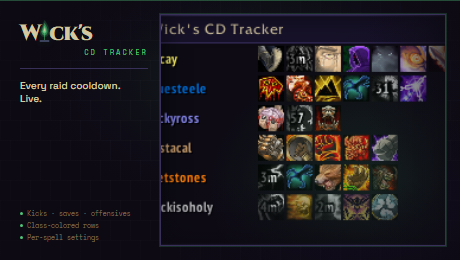

<p align="center"></p>

# Wick's CD Tracker

> Live party and raid cooldown tracker. Kicks, saves, offensives, utility — all in one tight panel.

Part of the **[Wick suite](https://github.com/jspliff/WickSuite)** — three precision addons built around a single fel-green-on-deep-purple aesthetic.

## Features

- **Live party/raid cooldowns** — Kick, Battle Rez, Soulstone, Bloodlust, Pain Suppression, Innervate, Tricks of the Trade, and more.
- **Class-colored rows** for fast read-at-a-glance during combat.
- **Per-spell toggle** from the settings cog in the header.
- **"Interrupts only" mode** — single click to strip everything except kicks.
- **Resizable** — the BOTTOMRIGHT fel-green bracket doubles as the resize grip.
- **Position + size remembered** per character.

## Install

- **CurseForge:** [curseforge.com/wow/addons/wicks-cd-tracker](https://www.curseforge.com/wow/addons/wicks-cd-tracker)
- **Manual:** drop the `WicksCDTracker` folder into `World of Warcraft\_classic_\Interface\AddOns\`.

## Usage

```
/wcdt
```

Toggles the tracker. Click the cog in the header for per-spell settings.

## Compatibility

- **TBC Classic** (Burning Crusade / Anniversary) — Interface `20505`.
- Scales from 2-player party to 25-player raid.

## Brand

Uses the locked Wick palette and 10px/2px fel-green L-bracket chrome. See:
- `UI.lua` — tokens at top of file
- `CHANGELOG.md` — version history
- `logo.svg` — logomark source

## License

See `LICENSE` (if present) or project root.
